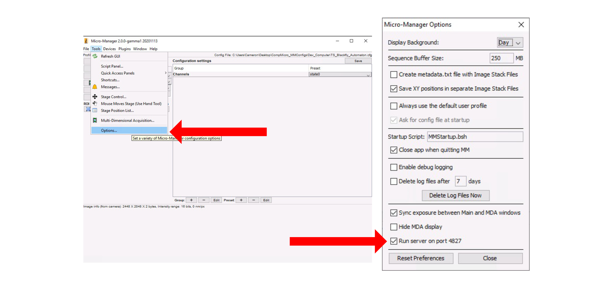
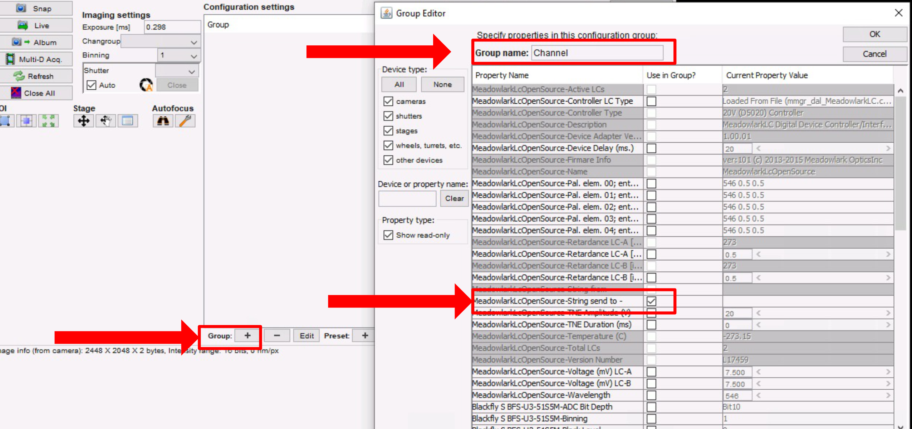

# recOrder Installation and MicroManager Setup Guide

### Installing recOrder software

Currently, recOrder has not been released via pip, so we will have to clone the repo and install it manually. If you do not have anaconda installed on your computer please follow the instructions here: https://docs.anaconda.com/anaconda/install/index.html

1. Open terminal and navigate to the directory to which recOrder will be installed (this is typically the home directory and can be accessed by the command cd ~

 

2. Clone the recOrder repo:

 

>  git clone https://github.com/mehta-lab/recOrder.git

 

3. Create a new conda environment

 

> conda create -n recOrder python=3.7

> conda activate recOrder

 

4. Install the repo as a package:

 

>  pip install -e ./recOrder

 

### Installing and Configuring MicroManager

 

recOrder is tested on MicroManager 2.0-gamma (11/13/2020) and beyond. You can find this version as well as newer versions under the MicroManager nightly builds https://micro-manager.org/Micro-Manager_Nightly_Builds . 

 

**This section assumes the user has installed the Meadowlark device adapter and has generated a proper startup configuration.  Please reach out to the corresponding author for details on how to get the device adapter**

 

The recOrder dependencies specify a specific version of *pycromanager* which relates to this MicroManager version. If you wish to use the latest version, please download from the MicroManager Website and install the latest version of pycromanager (pip install pycromanager)

 

1. You will need to enable port access so that micromanager can communicate with recOrder through the pycromanager bridge. To do so open MM and navigate to *Tools > Options* and check the box that says Run server on port 4827

2. Create a new channel group called “Channel” and add find the property *MeadowlarkLcOpenSource-String send to -.* Feel free to add any other relevant properties, but this is the bare minimum needed for calibration. Hit “OK” when finished.

3. Name each preset “State0”, “State1”, … , “State4” and add the corresponding “state0”, “state1” intothe  “*MeadowlarkLcOpenSource-String send to –“* property.

 

4. Once you have completed these steps you are now ready for calibration.
